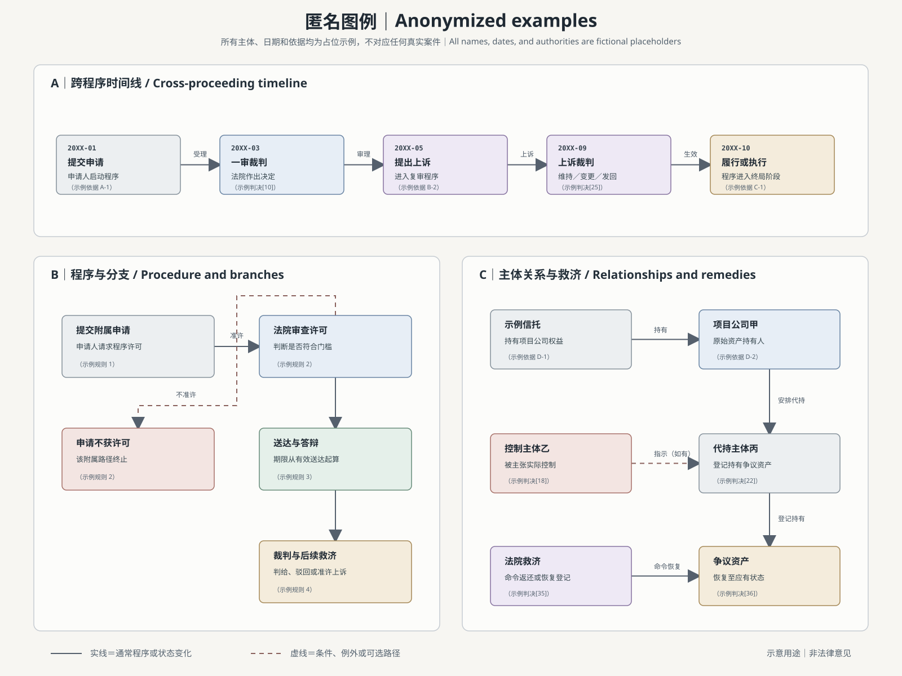

# 法律程序可视化 Skill

[English](README.md) | [简体中文](README.zh-CN.md)

把密集的判决、程序规则、案件材料和法律关系，转化为清晰、可编辑的可视化图表。

Legal Process Visualizer 是一个供 Codex 使用的法律可视化 skill，适合处理仅靠连续文字不容易看清的问题。它能够识别参与主体，整理事件顺序，区分主程序、例外和上诉路径，说明谁对谁实施了什么行为，并把支持每个结论的依据保留在图中。

## 可以制作什么

- **程序流程图**：展示申请、听证、裁判、送达、上诉、执行及替代路径。
- **诉讼时间线**：把不同法院或不同法域的事件放进同一时间顺序，同时保留彼此关系。
- **裁判决策树**：展示不同事实、条件或裁判结论会导向什么程序结果。
- **法律关系图**：展示所有权、控制、代理、信托、转让、责任、救济及其历史变化。
- **期限图**：把每个期限与启动该期限的具体事件连接起来。
- **多图协同组合**：一张图过于拥挤时，可以拆成主程序图、上诉图、关系图等相互配合的图表。
- **修改现有图表**：改善结构、依据标注、可读性以及含义不清的箭头。

通常交付可编辑 SVG，因此后续仍可修改名称、文字、颜色、位置和连接关系。

## 对法律工作有什么帮助

- 区分法条明文、司法解释、实务观察和说明性提示，不把它们混成同一种依据。
- 把条文或判决段落放在其所支持的程序步骤旁边，方便核对。
- 区分必须实施的行为与裁量选择，也区分法定期限与来源中没有规定固定期限的步骤。
- 把例外、驳回、发回、上诉、执行等容易遗漏的结果明确画出来。
- 检查每条箭头是否连接了真正的行为主体和目标，避免关系线指向空白处或让人误以为连接的是旁边标题。
- 可以严格限定来源，例如“仅使用这份判决”，也可以按用户要求纳入更广泛的规范材料。

## 去敏图例

这张完全虚构的三联图展示了三种常见交付形式：

- 跨程序时间线：保留事件顺序及每个阶段的程序性质；
- 程序与分支图：区分通常路径与不予许可、例外等分支；
- 主体关系与救济图：明确谁持有、控制或转让资产，以及谁负有恢复义务。

图中的主体名称、日期、段落编号和依据均为占位示例，不复制或影射任何真实个人、机构、争议、判决或财产。

## 使用示例

### 1. 把一份判决拆成三张协同图

**你可以这样说**

> 仅使用所附判决，制作三张可编辑图：跨法域案件时间线、法院的程序与裁判路径图、股权转移及救济关系图。每张图都标注相关判决段落。

**会得到什么**

一组分别回答三个问题的图：案件何时发生了什么，法院如何得出裁判结果，以及当事人、财产、转让和救济之间有什么关系。

### 2. 根据规则绘制完整程序

**你可以这样说**

> 把这套仲裁规则制作成从启动仲裁到作出最终裁决的详细程序图。包括通知、仲裁庭组成、回避、临时措施、证据、听证、裁决更正和规则明文规定的所有期限。

**会得到什么**

一张带依据的完整程序图。每个期限都对应明确的起算事件，可选路径和例外路径会与通常程序分开显示。

### 3. 解释上诉许可和后续结果

**你可以这样说**

> 制作一张决策树，说明是否需要上诉许可、谁可以准许、申请期限、可否获得临时救济，以及维持、变更、发回和驳回分别如何发生。

**会得到什么**

读者可以从原裁判出发，沿着适用条件找到可采取的上诉路径和可能结果，不必在多个条文之间来回查找。

### 4. 展示不断变化的持股与控制关系

**你可以这样说**

> 绘制法律关系图，展示信托、受托人、公司、实益所有人、代持主体、被转让股份和法院命令恢复的关系。标明每项关系何时开始或终止，并区分历史持有与当前持有。

**会得到什么**

一张有明确方向的关系图，说明谁曾经持有、控制或转让什么财产，以及谁负有恢复财产的义务，同时显示关系随时间发生的变化。

### 5. 修订已有法律图表

**你可以这样说**

> 检查这份可编辑 SVG。保留原来的视觉风格，但修正含义不清的箭头、拥挤的依据、遗漏的分支，以及任何超出来源原意的节点表述。

**会得到什么**

一份保留原设计语言、但法律关系更明确、来源边界更容易核对的修订图。

## 怎样获得更合适的结果

如果方便，可以提供：

- 法域和审理机构；
- 需要使用的判决、规则或其他材料；
- 是否严格限制来源，例如“仅使用这份判决”；
- 希望从哪个事件开始、到哪个结果结束；
- 需要一张完整图，还是多张协同图；
- 图表面向什么读者，以及希望达到什么详细程度；
- 最终图表是否必须可编辑。

如果没有提供这些信息，skill 只会确认那些确实会改变最终结果的关键选择。

## 范围说明

本 skill 用于辅助法律研究整理和可视化表达，不能替代特定法域的法律意见。无法取得的依据、存在争议的期限、推断内容或有意省略的程序路径，应作为限制明确保留，而不应由系统自行补全。
